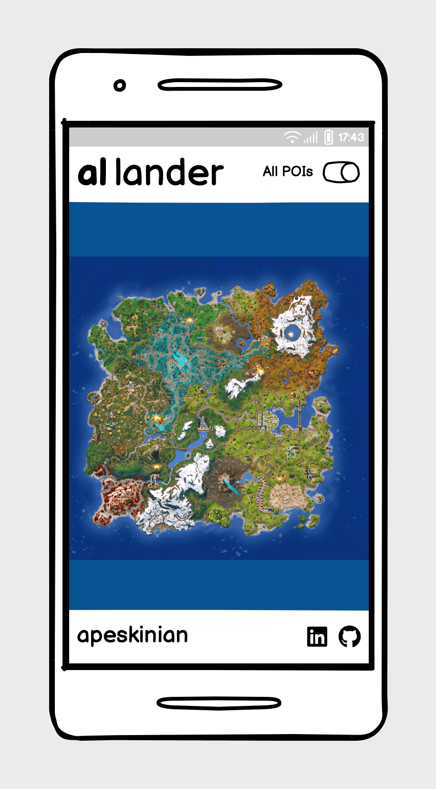

# [a| lander](https://lander.apeskinian.com)

## A simple and elegant landing zone picker for your next Fortnite Battle Royale!

Tired of the same drop spots? Debating with your squad about where to land? Let a|lander take the pressure off.

**a|lander** is your intuitive, map-driven companion for Fortnite. Designed to answer the age-old question: “Where are we landing?” With a single tap, it randomly selects a point of interest (POI) from the current map and zooms in to highlight the spot. Whether you’re looking to shake up your routine or explore hidden corners you’ve never visited, a|lander makes every exciting.

Choose between:

-  All available POIs and named locations for full exploration.
-  Main POIs only for a more focused experience.

No more indecision. No more arguments. Just a touch of fate guiding your next landing zone.

Data for this app is provided by [Fortnite-API](https://fortnite-api.com/).

source: [Am I Responsive Multi Device Website Mockup Generator](https://ui.dev/amiresponsive?url=https://lander.apeskinian.com/)

## UX

### Strategy

**Purpose**
- Provide the user with a landing site for a Battle Royale in Fortnite that is randomly chosen from the current list of POIs provided by the API.

**Primary User Needs**
- Users need a suggested landing site with minimal interaction.
- They also need to repeat this easily.

### Scope

**Features**

Full details on [Features](#features) can be viewed below, essentially I wanted to include:
- Easy interaction with minimal input to get a landing site.
- Easily repeatable action to get new suggestions.
- The ability to toggle between the full POI list and the main POIs provided by the API.

**Content Requirements**

- Up to date map image for the current iteration of Fortnite.
- Up to date POI information for the current iteration of Fortnite.
- Easy to view main map area with clear indicator of selected site.
- Easy toggle to change between POI preferences.
- Error messages if there are issues fetching data.

### Structure

The site is a Single Page Application and by design is simple and easy to use.

There is a header at the top of the page containing the app name and a toggle switch. Clicking on the **a|** of the title will take the user to my [portfolio](https://www.apeskinian.com) site. Clicking on the **lander** portion will reset the app by removing any selected POIs and zooming out.

The toggle on the right hand side of the header will control which POI set is used to generate a landing site. Toggling this will change the POI set accordingly whilst resetting the map ready to start again.

The main focus of the app is the map area that shows the current Fortnite Battle Royale map. To start the user clicks anywhere on the map. When a POI is picked, a marker will be placed and the map will zoom in tighter onto the marker. Clicking again will pick another marker and the process will repeat.

If there are any errors in fetching the data, the map will be replaced by an information message informing the user.

The bottom of the page contains a footer with another link to my [portfolio](https://www.apeskinian.com) along with links to my [LinkedIn](https://www.linkedin.com/in/apeskinian/) profile and [GitHub](https://github.com/apeskinian) profile.

### Skeleton

In the wire framing process I decided that the interface needed to be as simple and easy as possible. Minimal input for maximum output. A clean interface with emphasis on the map area as that is the focus of the app.

A full list of [Wireframes](#wireframes) can be viewed in detail below.

### Surface

**Visual Design Elements**

- **[Colours](#colour-scheme)**: see below.
- **[Typography](#typography)**: see below.

### Colour Scheme

The colour scheme for the site is a monochromatic interface combined with the full colour of the Fortnite map. A yellow marker is overlaid to highlight POIs.

| Colour Reference | Usage |
| --- | --- |
| #FCD34D | POI Marker |
| #093576 | Background for the map image |
| #6a7282 | Footer text and icons |

### Typography

#### Fonts

- [Fjalla One](https://fonts.google.com/specimen/Fjalla+One) was used for the **a|** in the header and the label for the POIs on the map.

- [Fira Sans](https://fonts.google.com/specimen/Fira+Sans) was used for the **lander** in the header and all other text.

#### Icons

- The favicon for the site is from [SVGREPO](https://www.svgrepo.com/):

    | Icon | Name |
    | --- | --- |
    |  | [Parachute](https://www.svgrepo.com/svg/24339/parachute) |

- [Font Awesome](https://fontawesome.com) icons were used across the site for various uses:

    | Icon | Name | Use |
    | --- | --- | --- |
    |  | [bullseye](https://fontawesome.com/icons/bullseye?f=classic&s=solid "font awesome link") | POI Highlight |
    |  | [linkedin](https://fontawesome.com/icons/linkedin?f=brands&s=solid "font awesome link") | LinkedIn footer link |
    |  | [github](https://fontawesome.com/icons/github?f=brands&s=solid "font awesome link") | GitHub footer link |

## User Stories

| User | Capability | Benefit |
| --- | --- | --- |
| As a user | I can be given a place to land in Fortnite Battle Royale | so that I don't have to worry about choosing where to land. |
| As a user | I can interact with the app using simple taps or clicks | so that I can quickly get a result without complex navigation.  |
| As a user | I can easily request a new POI | so that I have a new landing site for the next Battle Royale. |
| As a user | I can choose whether to use just the main POIs or the full set of POIs | so that I can either focus on landing in the main areas or decide to explore a little further for more challenging starts. |
| As a user | I can toggle between POI sets easily | so that I don't have to spend too much time on preferences. |
| As a user | I can see the chosen POI focused and zoomed in on the map | so that know exactly where to land. |
| As a user | I can see the name of the POI | so that I know where I am landing. |
| As a user | I can access and use the app on mobile devices | so that can us it wherever I play Fortnite. |
| As a user | I can install the app as a PWA on my homescreen | so that it feels like a native app with fast access. |
| As a user | I can see welcome message on first launch | so that I understand how to use the app. |
| As a user | I can use the app without needing to sign in | so that I can jump straight into gameplay without any friction. |
| As a user | I can rely on the app to be responsive across devices | so that I can always see the map and POI clearly no matter my device. |
| As a user | I can use the app in landscape or portrait mode | so that it adapts to how I hold my device. |
| As a user | I can rely that the map and POIs are up to date | so that I don't need to worry about having to input anything myself to update it. |

## Wireframes

To follow best practice, wire frames were developed for mobile, tablet, and desktop sizes.
I've used [Balsamiq](https://balsamiq.com/wireframes) to design my site wireframes.

### Mobile Wireframes
| Whole Map View | Highlighted POI View |
| --- | --- |
|  |  |

### Tablet Wireframes
| Whole Map View | Highlighted POI View |
| --- | --- |
|  |  |

### Desktop Wireframes
| Whole Map View | Highlighted POI View |
| --- | --- |
|  |  |