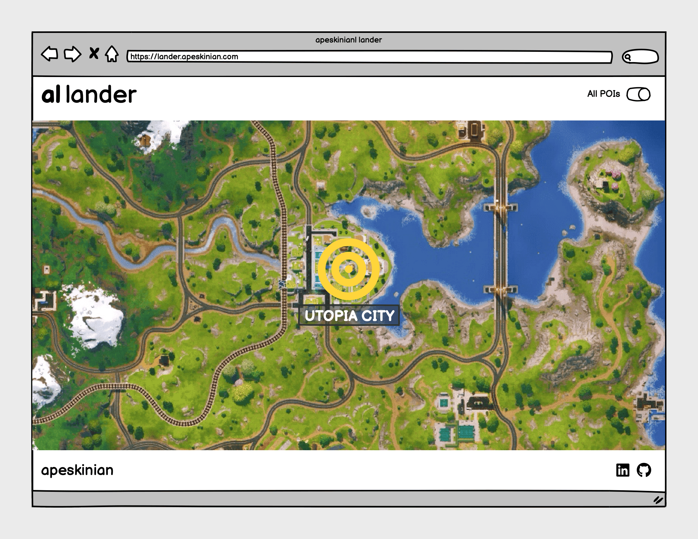
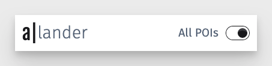
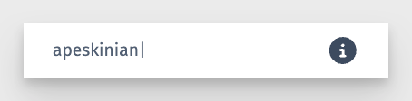
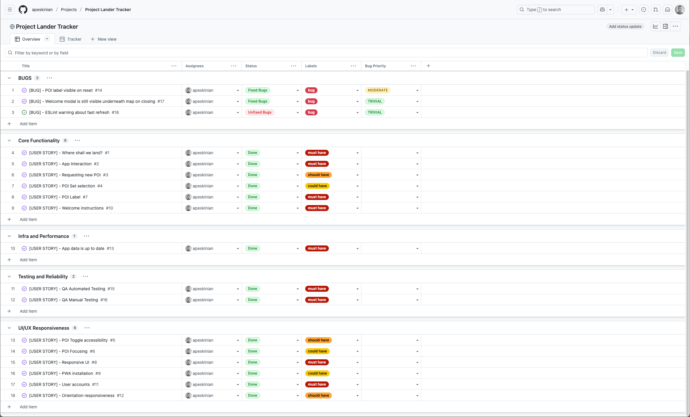

# [a| lander](https://lander.apeskinian.com)

## A simple and elegant landing zone picker for your next Fortnite Battle Royale!

Tired of the same drop spots? Debating with your squad about where to land? Let a|lander take the pressure off.

**a|lander** is your intuitive, map-driven companion for Fortnite. Designed to answer the age-old question: “Where are we landing?” With a single tap, it randomly selects a point of interest (POI) from the current map and zooms in to highlight the spot. Whether you’re looking to shake up your routine or explore hidden corners you’ve never visited, a|lander makes every exciting.

Choose between:

-  All available POIs and named locations for full exploration.
-  Main POIs only for a more focused experience.

No more indecision. No more arguments. Just a touch of fate guiding your next landing zone.

Data for this app is provided by [Fortnite-API](https://fortnite-api.com/).

source: [Am I Responsive Multi Device Website Mockup Generator](https://ui.dev/amiresponsive?url=https://lander.apeskinian.com/)

## UX

### Strategy

**Purpose**
- Provide the user with a landing site for a Battle Royale in Fortnite that is randomly chosen from the current list of POIs provided by the API.

**Primary User Needs**
- Users need a suggested landing site with minimal interaction.
- They also need to repeat this easily.

### Scope

**Features**

Full details on [Features](#features) can be viewed below, essentially I wanted to include:
- Easy interaction with minimal input to get a landing site.
- Easily repeatable action to get new suggestions.
- The ability to toggle between the full POI list and the main POIs provided by the API.

**Content Requirements**

- Up to date map image for the current iteration of Fortnite.
- Up to date POI information for the current iteration of Fortnite.
- Easy to view main map area with clear indicator of selected site.
- Easy toggle to change between POI preferences.
- Error messages if there are issues fetching data.

### Structure

The site is a Single Page Application and by design is simple and easy to use.

There is a header at the top of the page containing the app name and a toggle switch. Clicking on the **a|** of the title will take the user to my [portfolio](https://www.apeskinian.com) site. Clicking on the **lander** portion will reset the app by removing any selected POIs and zooming out.

The toggle on the right hand side of the header will control which POI set is used to generate a landing site. Toggling this will change the POI set accordingly whilst resetting the map ready to start again.

The main focus of the app is the map area that shows the current Fortnite Battle Royale map. To start the user clicks anywhere on the map. When a POI is picked, a marker will be placed and the map will zoom in tighter onto the marker. Clicking again will pick another marker and the process will repeat.

If there are any errors in fetching the data, the map will be replaced by an information message informing the user.

The bottom of the page contains a footer with another link to my [portfolio](https://www.apeskinian.com) along with links to my [LinkedIn](https://www.linkedin.com/in/apeskinian/) profile and [GitHub](https://github.com/apeskinian) profile.

### Skeleton

In the wire framing process I decided that the interface needed to be as simple and easy as possible. Minimal input for maximum output. A clean interface with emphasis on the map area as that is the focus of the app.

A full list of [Wireframes](#wireframes) can be viewed in detail below.

### Surface

**Visual Design Elements**

- **[Colours](#colour-scheme)**: see below.
- **[Typography](#typography)**: see below.

### Colour Scheme

The colour scheme for the site is a monochromatic interface combined with the full colour of the Fortnite map. A yellow marker is overlaid to highlight POIs.

| Colour Reference | Usage |
| --- | --- |
| #FFD700 | POI Marker |
| #093576 | Background for the map image |
| #4a5568 | Footer text and icons |

### Typography

#### Fonts

- [Fjalla One](https://fonts.google.com/specimen/Fjalla+One) was used for the **a|** in the header and the label for the POIs on the map.

- [Fira Sans](https://fonts.google.com/specimen/Fira+Sans) was used for the **lander** in the header and all other text.

#### Icons

- The favicon for the site is from [SVGREPO](https://www.svgrepo.com/):

    | Icon | Name |
    | --- | --- |
    |  | [Parachute](https://www.svgrepo.com/svg/24339/parachute) |

- [Font Awesome](https://fontawesome.com) icons were used across the site for various uses:

    | Icon | Name | Use |
    | --- | --- | --- |
    |  | [bullseye](https://fontawesome.com/icons/bullseye?f=classic&s=solid "font awesome link") | POI Highlight |
    |  | [circle info](https://fontawesome.com/icons/circle-info?f=classic&s=solid "font awesome link") | Help dialog button |

## User Stories

| User | Capability | Benefit |
| --- | --- | --- |
| As a user | I can be given a place to land in Fortnite Battle Royale | so that I don't have to worry about choosing where to land. |
| As a user | I can interact with the app using simple taps or clicks | so that I can quickly get a result without complex navigation.  |
| As a user | I can easily request a new POI | so that I have a new landing site for the next Battle Royale. |
| As a user | I can choose whether to use just the main POIs or the full set of POIs | so that I can either focus on landing in the main areas or decide to explore a little further for more challenging starts. |
| As a user | I can toggle between POI sets easily | so that I don't have to spend too much time on preferences. |
| As a user | I can see the chosen POI focused and zoomed in on the map | so that know exactly where to land. |
| As a user | I can see the name of the POI | so that I know where I am landing. |
| As a user | I can access and use the app on mobile devices | so that I can use it wherever I play Fortnite. |
| As a user | I can install the app as a PWA on my homescreen | so that it feels like a native app with fast access. |
| As a user | I can see a welcome message on first launch | so that I understand how to use the app. |
| As a user | I can use the app without needing to sign in | so that I can jump straight into gameplay without any friction. |
| As a user | I can use the app in landscape or portrait mode | so that it adapts to how I hold my device. |
| As a user | I can rely that the map and POIs are up to date | so that I don't need to worry about having to input anything myself to update it. |
| As a developer | I should carry about automated testing on all applicable files | so that I catch problems early and ensure consistent behaviour across updates. |
| As a developer | I should perform manual testing across key user flows and devices | so that I can validate real-world usability, catch edge cases not covered by automation, and ensure a smooth experience for all users. |

## Wireframes

To follow best practice, wire frames were developed for mobile, tablet, and desktop sizes.
I've used [Balsamiq](https://balsamiq.com/wireframes) to design my site wireframes.

### Mobile Wireframes
| Whole Map View | Highlighted POI View |
| --- | --- |
|  |  |

### Tablet Wireframes
| Whole Map View | Highlighted POI View |
| --- | --- |
|  |  |

### Desktop Wireframes
| Whole Map View | Highlighted POI View |
| --- | --- |
|  |  |

## Features

### Existing Features

- ### Header

    The page header contains the main title of app along with a toggle for changing the POI set that is used to generate a landing site. The title has two additional functions:

    - The '**a|**' portion of the title is a link to my [portfolio](https://www.apeskinian.com) website.
    - The '**lander**' portion of the title will reset the map when clicked. The current POI will be removed and the map will zoom out to the starting position.

    

- ### Footer

    The page footer contains a link to my [portfolio](https://www.apeskinian.com) website on the left and a button to open the help dialog on the right shown by a font awesome icon.

    

- ### Help Dialog

    When the app is first run and the help dialog is shown with the simple instructions on how to use the app. This can be accessed any time via the info button in the footer.

    

- ### Map

    The map is the main focus of the app and shows the current Fortnite Battle Royale map. When the user clicks on the map a random POI is chosen and a marker is placed. The map then zooms in to focus on the POI and the name label is then shown. To get a new POI the user just clicks again, this process can be repeated.

    | Map Usage | Base Map | Highlighted POI |
    | --- | --- | --- |
    |  |  |  |

### Future Features

There are no current plans for future features, the app is designed to be as minimal and efficient as possible.

## Tools & Technologies

| Tool / Tech | Use |
| --- | --- |
|  | Generate README and TESTING templates. |
|  | Version control. (`git add`, `git commit`, `git push`) |
|  | Secure online code storage. |
|  | Local IDE for development. |
|  | Deploying React app to GitHub |
|  | Domain hosting and DNS forwarding to GitHub Pages |
|  | Frontend library for creating the site. |
|  | Frontend Build Tool |
|  | Main site content and layout. |
|  | Main site content and layout. |
|  | Design and layout. |
|  | User interaction on the site. |
|  | Front-end CSS framework for modern responsiveness. |
|  | Automated unit and integration testing. |
|  | Automated end-to-end testing. |
|  | Providing up-to-date data for Fortnite Battle Royale |
|  | Creating wireframes. |
|  | Icons. |
|  | Help debug, troubleshoot, and explain things. |
|  | Image optimisation. |
|  | 	Screenshot and screen recording capture. |
|  | Computing coordinates |

## Agile Development Process

### GitHub Projects

[GitHub Projects](https://github.com/users/apeskinian/projects/12) served as an Agile tool for this project. Through it, User Stories, issues/bugs, and Milestone tasks were planned, then subsequently tracked on a regular basis using the Kanban project board.

I also created an overview page where I could easily see at a glance the current progress in development. This allowed me to track start and finish dates along with adding prioritisation for bugs.

### GitHub Issues

[GitHub Issues](https://www.github.com/apeskinian/project_lander/issues) served as an another Agile tool. There, I managed my User Stories and Milestone tasks, and tracked any issues/bugs.

 

| Open Issues |
| :---: |
|  |

| Closed Issues |
| :---: |
|  |

### MoSCoW Prioritization

I've decomposed my Epics into User Stories for prioritizing and implementing them. Using this approach, I was able to apply "MoSCow" prioritization and labels to my User Stories within the Issues tab.

- **Must Have**: guaranteed to be delivered - required to Pass the project (*max ~60% of stories*)
- **Should Have**: adds significant value, but not vital (*~20% of stories*)
- **Could Have**: has small impact if left out (*the rest ~20% of stories*)
- **Won't Have**: not a priority for this iteration - future features

The GitHub projects helped keep track of this with the creation of a graph.

