# Testing

> [!NOTE]
> Return back to the [README.md](README.md) file.

## Code Validation

### HTML

I have used the recommended [HTML W3C Validator](https://validator.w3.org) to validate the index HTML file.

| File | URL | Screenshot | Notes |
| ---| --- | --- | --- |
| [index.html](/index.html) | [W3 Validator](https://validator.w3.org/nu/?doc=https%3A%2F%2Flander.apeskinian.com%2F) |  | No warnings or errors found. |

### CSS

I have used the recommended [CSS Jigsaw Validator](https://jigsaw.w3.org/css-validator) to validate my CSS file.

| File | Screenshot | Notes |
| --- | --- | --- |
| [App.css](/src/App.css) |  | No errors or warnings found. |

### JavaScript & JSX

I used [ESLint](https://eslint.org/) to validate all JavaScript and JSX code in real time during development.

To ensure consistent code quality and catch issues early, I used a modular ESLint setup tailored for JavaScript, JSX, Cypress, and Vitest environments. The configuration supports React Fast Refresh, enforces best practices, and allows pragmatic overrides where necessary.

```
import js from '@eslint/js';
import globals from 'globals';
import reactHooks from 'eslint-plugin-react-hooks';
import reactRefresh from 'eslint-plugin-react-refresh';
import cypress from 'eslint-plugin-cypress';
import vitest from 'eslint-plugin-vitest';
import { defineConfig, globalIgnores } from 'eslint/config';

export default defineConfig([
  globalIgnores(['dist']),
  {
    files: ['**/*.{js,jsx}'],
    extends: [
      js.configs.recommended,
      reactHooks.configs['recommended-latest'],
      reactRefresh.configs.vite,
    ],
    languageOptions: {
      ecmaVersion: 2020,
      globals: globals.browser,
      parserOptions: {
        ecmaVersion: 'latest',
        ecmaFeatures: { jsx: true },
        sourceType: 'module',
      },
    },
    rules: {
      'no-unused-vars': ['error', { varsIgnorePattern: '^[A-Z_]' }],
      'semi': ['error', 'always'],
    },
  },
  {
    files: ['cypress/**/*.js'],
    plugins: { cypress },
    ...cypress.configs.recommended,
  },
  {
    files: ['**/*.test.{js,jsx}'],
    plugins: { vitest },
    ...vitest.configs.recommended,
    languageOptions: {
      ecmaVersion: 2020,
      sourceType: 'module',
      parserOptions: {
        ecmaVersion: 'latest',
        ecmaFeatures: { jsx: true },
      },
      globals: {
        ...globals.browser,
        ...vitest.environments.env.globals,
      },
    },
  }
]);
```

## Responsiveness

I've tested my deployed project to check for responsiveness issues. For mobile devices I included PWA installed versions as well as portrait and landscape orientations.

| Device | Whole Map View | Highlighted POI | Notes |
| --- | --- | --- | --- |
| Mobile (devtools) |  |  | Works as expected. |
| Tablet (devtools) |  |  | Works as expected. |
| Desktop (devtools) |  |  | Works as expected. |
| 2k Screen (devtools) |  |  | Works as expected. |
| iPhone 16 Pro (portrait) |  |  | Works as expected. |
| iPhone 16 Pro (landscape) |  |  | Some clipping on two line POI labels. |
| iPhone 16 Pro PWA (portrait) |  |  | Works as expected. |
| iPhone 16 Pro PWA (landscape) |  |  | Works as expected. |
| iPad Mini (portrait) |  |  | Works as expected. |
| iPad Mini (landscape) |  |  | Works as expected. |
| iPad Mini PWA (portrait) |  |  | Works as expected. |
| iPad Mini PWA (landscape) |  |  | Works as expected. |
| Samsung Galaxy Tab 6 Lite (portrait) |  |  | Works as expected. |
| Samsung Galaxy Tab 6 Lite (landscape) |  |  | Works as expected. |
| Samsung Galaxy Tab 6 Lite PWA (portrait) |  |  | Works as expected. |
| Samsung Galaxy Tab 6 Lite PWA (landscape) |  |  | Works as expected. |
| MacBook Air M3 |  |  | Works as expected. |
| 2K Monitor |  |  | Works as expected. |

## Browser Compatibility

I've tested my deployed project on multiple browsers to check for compatibility issues.

| Page | Chrome | Firefox | Safari | Edge | Notes |
| --- | --- | --- | --- | --- | --- |
| Map |  |  |  |  | No issues found. |
| Highlighted POI |  |  |  |  | POI marker in Safari is pixelated. |

## Lighthouse Audit

I've tested my deployed project using the Lighthouse Audit tool to check for any major issues. Some warnings are outside of my control, and mobile results tend to be lower than desktop.

| Mobile | Desktop | Notes |
| --- | --- | --- |
|  |  | Mobile performance is slower in lighthouse test. |

## Defensive Programming

Defensive programming was manually tested with the below user acceptance testing:

### Page Navigation
| Expectation | Test | Result | Screenshot |
| --- | --- | --- | --- |
| A help modal is shown to the user on first visit to the site. | Visit the site for the first time. | SUCCESS - the modal is shown. |  |
| The help modal is not shown automatically if the user revisits the site. | After the first visit, refresh the page. | SUCCESS - the modal does not appear automatically. |  |
| Clicking outside the modal when it is shown does nothing. | When the help modal is being shown, try and click the map and other elements. | SUCCESS - the modal stays open. |  |
| The help modal can be closed with the 'close' button. | Click on the 'close' button of the help modal. | SUCCESS - the modal is closed. |  |
| The help modal can be closed with the 'escape' key. | Press the 'escape' key on the keyboard when the help modal is displayed. | SUCCESS - the modal is closed. |  |
| Clicking on the **a\|** portion of the page title will open the [portfolio](https://www.apeskinian.com) site in a new browser tab. | Click on the **a\|** in the page header. | SUCCESS - the user is taken to the [portfolio](https://www.apeskinian.com) site in a new browser tab. |  |
| Clicking on the toggle at the top of the page will switch between **All POIs** and **Main POIs** being shown. | Click the toggle input in the page header. | SUCCESS - the POI sets are switched. |  |
| Clicking on the **apeskinian\|** link at the bottom of the page will open the [portfolio](https://www.apeskinian.com) site in a new browser tab. | Click on the **apeskinian\|** link in the page footer. | SUCCESS - the user is taken to the [portfolio](https://www.apeskinian.com) site in a new browser tab. |  |
| Clicking on the **i** button at the bottom of the page will show the help modal. | Click on the **i** button in the page footer. | SUCCESS - the modal is shown. |  |
| When the API is being accessed, a loading indicator is shown to the user. | In a development server simulate a delay and reload the page. | SUCCESS - a loading message can be seen. |  |
| If there is an error loading the data the user is shown a message. | In a development server manually create an error when fetching data. | SUCCESS - an error message is displayed. |  |
| If there is no data available the user is shown a message. | In a development server, do not send any map data to the client. | SUCCESS - a no map data message is displayed. |  |

### POI Picking
| Expectation | Test | Result | Screenshot |
| --- | --- | --- | --- |
| Clicking on the map displays a marker to a POI and then zooms in to show a label for the POI. | Click on the map. | SUCCESS - a POI was selected and then zoomed in on. The label was shown. |  |
| If a POI is already being shown, clicking the map again will clear the POI, zoom out, select a new POI, show a marker, and zoom in again to show the label for the POI. | When a POI is already being shown, click on the map. | SUCCESS - the POI was cleared, the map zoomed out, and a new POI was selected. |  |
| Clicking on the **lander** portion of the page title will clear any current POI selection and reset the map. | Click on the **lander** portion of the title when a POI is being shown. | SUCCESS - the POI was cleared and the map reset. |  |
| Clicking on the toggle at the top of the page will also clear any current POI selection and reset the map. | Click on the toggle input when a POI is being shown. | SUCCESS - the POI was cleared and the map reset. |  |
| Clicking on the **lander** portion of the page title will cancel any current selection mid-process and reset the map. | Click on the **lander** portion of the title when a POI is actively being selected. | SUCCESS - the current POI selection process was cancelled and the map reset. |  |
| Clicking on the toggle at the top of the page will cancel any current selection mid-process and reset the map. | Click on the toggle input when a POI is actively being selected. | SUCCESS - the current POI selection process was cancelled and the map reset. |  |
| Clicking on the map multiple times while a POI is being selected will not interrupt the process.  | When a POI is actively being selected, click the map multiple times. | SUCCESS - the POI selection was not interrupted. |  |
| Clicking on the map multiple times while a POI is being selected will not queue up multiple clicks and start a chain of selections. | When a POI is actively being selected, click the map multiple times. | SUCCESS - multiple clicks were not queued. |  |

## User Story Testing

## User Stories

| Target | Expectation | Outcome | Screenshot |
| --- | --- | --- | --- |
| As a user | I can be given a place to land in Fortnite Battle Royale | so that I don't have to worry about choosing where to land. |  |
| As a user | I can interact with the app using simple taps or clicks | so that I can quickly get a result without complex navigation.  |  |
| As a user | I can easily request a new POI | so that I have a new landing site for the next Battle Royale. |  |
| As a user | I can choose whether to use just the main POIs or the full set of POIs | so that I can either focus on landing in the main areas or decide to explore a little further for more challenging starts. |  |
| As a user | I can toggle between POI sets easily | so that I don't have to spend too much time on preferences. |  |
| As a user | I can see the chosen POI focused and zoomed in on the map | so that know exactly where to land. |  |
| As a user | I can see the name of the POI | so that I know where I am landing. |  |
| As a user | I can access and use the app on mobile devices | so that I can use it wherever I play Fortnite. |  |
| As a user | I can install the app as a PWA on my homescreen | so that it feels like a native app with fast access. |  |
| As a user | I can see a welcome message on first launch | so that I understand how to use the app. |  |
| As a user | I can use the app without needing to sign in | so that I can jump straight into gameplay without any friction. |  |
| As a user | I can use the app in portrait mode | so that it adapts to how I hold my device. |  |
| As a user | I can use the app in landscape mode | so that it adapts to how I hold my device. |  |
| As a user | I can rely that the map and POIs are up to date | so that I don't need to worry about having to input anything myself to update it. | 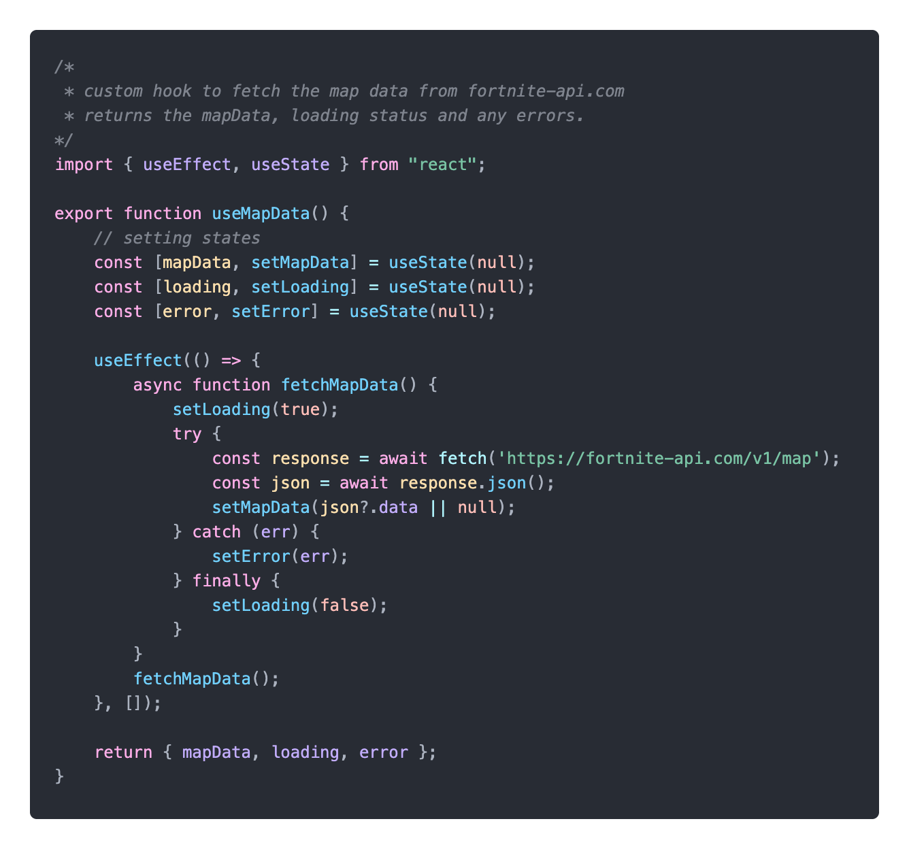 |
| As a developer | I should carry out automated testing on all applicable files | so that I catch problems early and ensure consistent behaviour across updates. | [Automated Testing](#automated-testing) |
| As a developer | I should perform manual testing across key user flows and devices | so that I can validate real-world usability, catch edge cases not covered by automation, and ensure a smooth experience for all users. | [Defensive Programming](#defensive-programming) |

## Automated Testing

### React (Unit Testing with Vitest & Coverage)

I used Vitest alongside React Testing Library to validate component behavior and generate coverage reports.

**Installation**

To get started, I installed Vitest and the coverage provider:

`npm install --save-dev vitest @vitest/coverage-v8`

**Configuration**

In `vite.config.js` I added the following to configure the tests:

```
  test: {
    globals: true,
    environment: 'jsdom',
    setupFiles: './src/setupTests.ts',
    coverage: {
      provider: 'v8',
      reporter: ['text', 'html'],
      include: ['src/**/*.{js,jsx,ts,tsx}'],
      exclude: ['src/main.jsx']
    },
```

I also added the following line in `package.json` to run the test package from a script:

```
"scripts": {
  "test": "vitest run --coverage"
}
```

**Running Tests**

Tests were run and a coverage report was created with `npm run test`

**Coverage Reports**

After the tests run, coverage generates both a terminal report and a html version. The html version can be found in the coverage folder in the root directory of the app.

| Terminal Report | HTML Report |
| --- | --- |
| 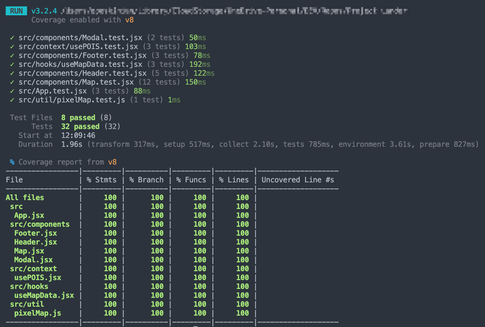 | 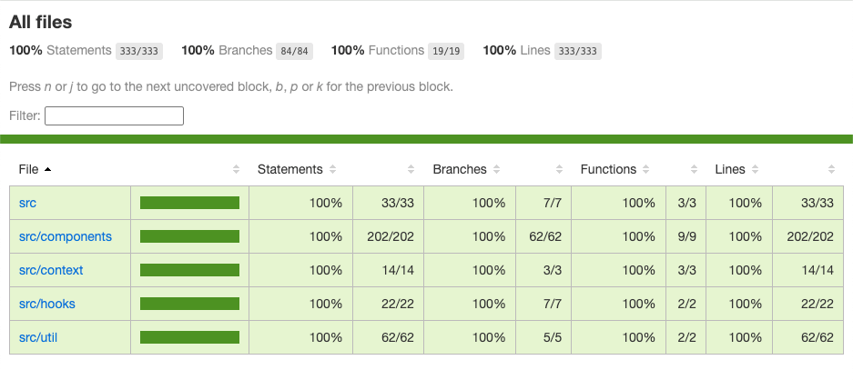 |

**Individual File Reports**
| File | Coverage | Screenshot |
| --- | --- | --- |
| [App.jsx](/src/App.jsx) | 100% | 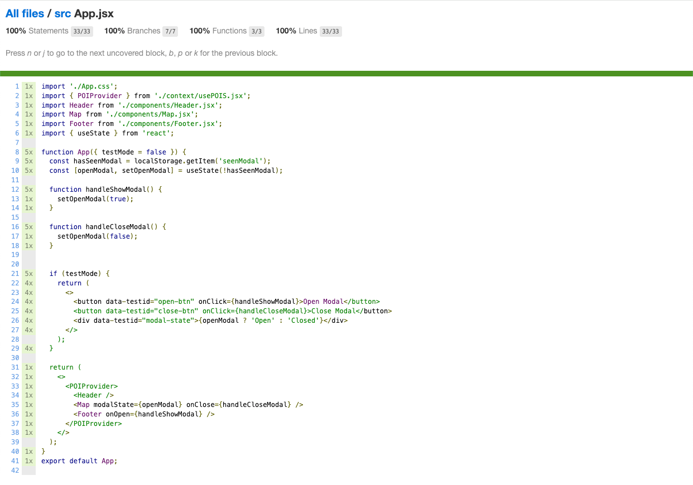 |
| [Footer.jsx](/src/components/Footer.jsx) | 100% | 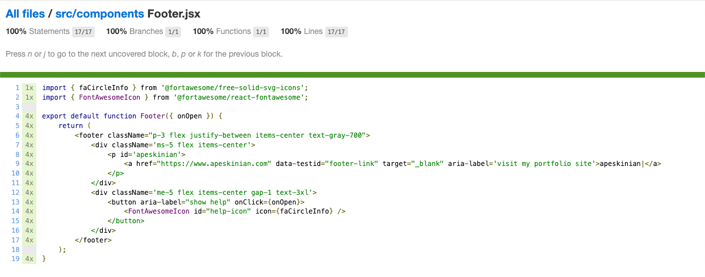 |
| [Header.jsx](/src/components/Header.jsx) | 100% | 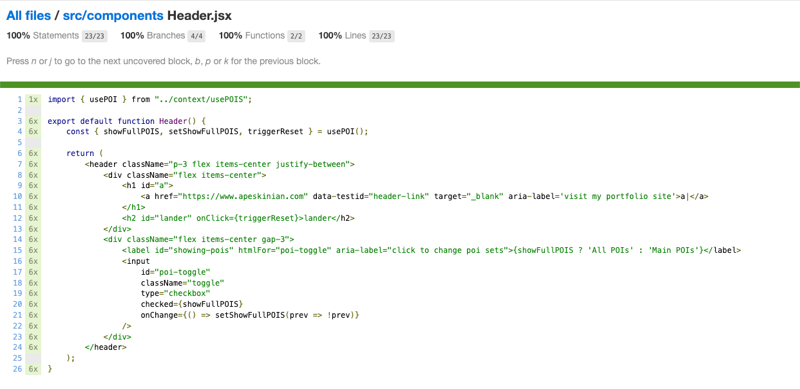 |
| [Map.jsx](/src/components/Map.jsx) | 100% | 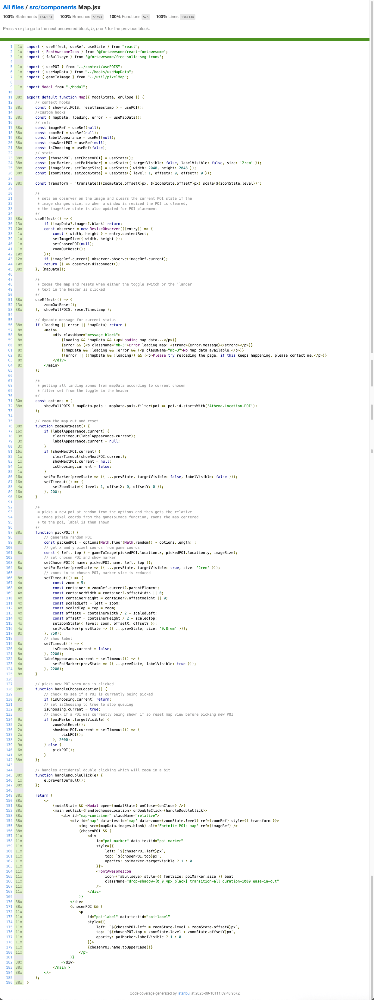 |
| [Modal.jsx](/src/components/Modal.jsx) | 100% | 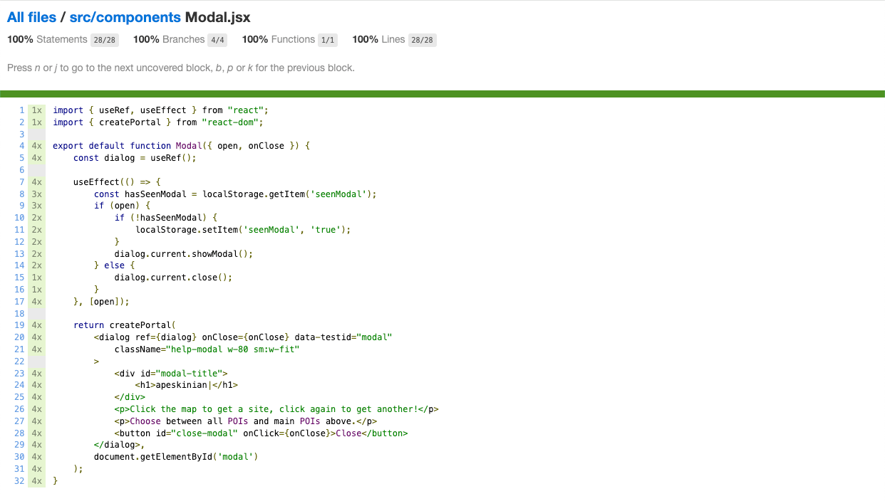 |
| [usePOIS.jsx](/src/context/usePOIS.jsx) | 100% | 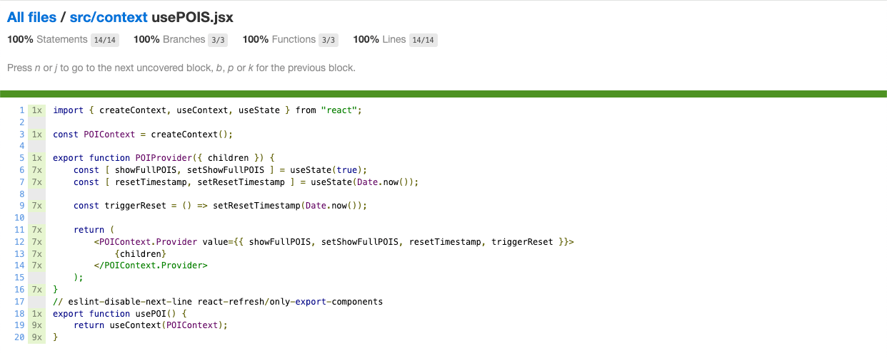 |
| [useMapData.jsx](/src/hooks/useMapData.jsx) | 100% | 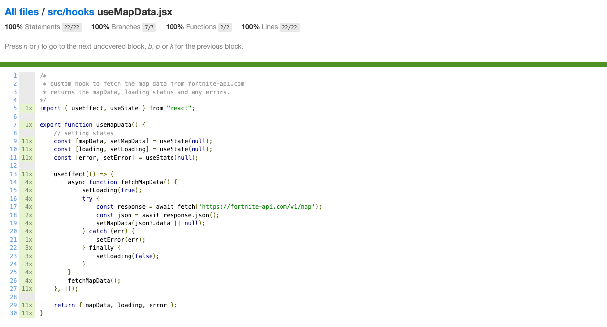 |
| [pixelMap.js](/src/util/pixelMap.js) | 100% | 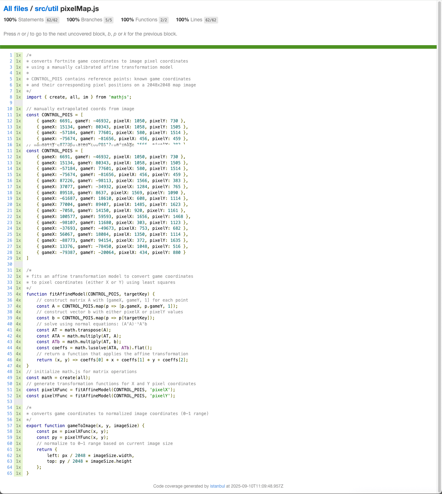 |

### Cypress (E2E Testing)

I used Cypress to validate the end-to-end functionality of the application, simulating real user interactions across critical flows.

To install Cypress, I ran the following command:

`npm install --save-dev cypress`

To launch the Cypress Test Runner in interactive mode, I ran:

`npx cypress open`

This opened a GUI where I could select and run E2E test specs, inspect DOM snapshots, and debug test flows in real time.

To run all tests in the terminal (useful for CI or quick checks), I used:

`npx cypress run`

I structured my test files under the cypress/e2e/ directory, and used Cypress’s built-in commands like cy.visit(), cy.get(), and cy.contains() to simulate user behavior and assert expected outcomes.

Below are the results from the full E2E test suite that I ran using Cypress:

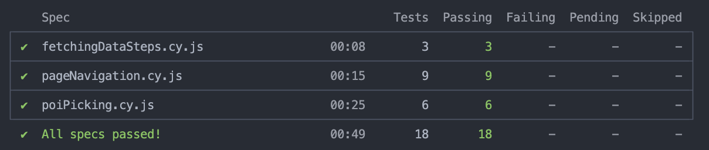

| Test File | Running Tests |
| --- | --- |
| [fetchingDataSteps.cy.js](/cypress/e2e/fetchingDataSteps.cy.js) | 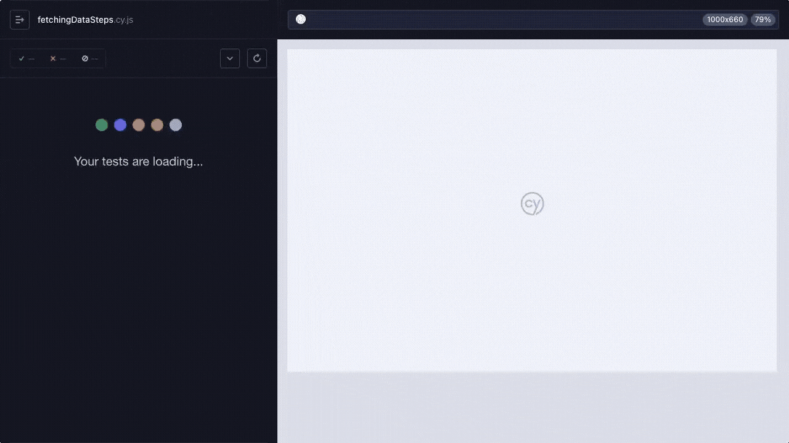 |
| [pageNavigation.cy.js](/cypress/e2e/pageNavigation.cy.js) |  |
| [poiPicking.cy.js](/cypress/e2e/poiPicking.cy.js) |  |