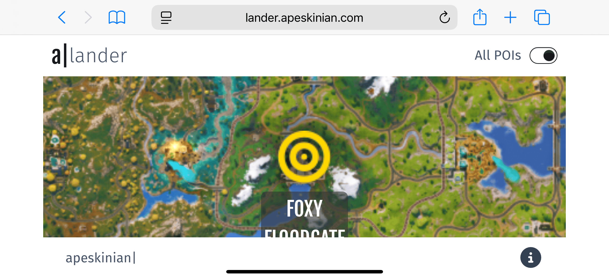
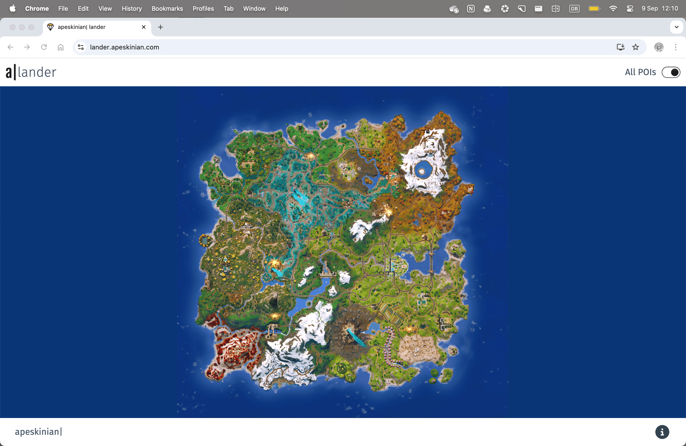

# Testing

> [!NOTE]
> Return back to the [README.md](README.md) file.

## Code Validation

### HTML

I have used the recommended [HTML W3C Validator](https://validator.w3.org) to validate the index HTML file.

| File | URL | Screenshot | Notes |
| ---| --- | --- | --- |
| [index.html](/index.html) | [W3 Validator](https://validator.w3.org/nu/?doc=https%3A%2F%2Flander.apeskinian.com%2F) |  | No warnings or errors found. |

### CSS

I have used the recommended [CSS Jigsaw Validator](https://jigsaw.w3.org/css-validator) to validate my CSS file.

| File | Screenshot | Notes |
| --- | --- | --- |
| [App.css](/src/App.css) |  | No errors or warnings found. |

### JavaScript & JSX

I used [ESLint](https://eslint.org/) to validate all JavaScript and JSX code in real time during development.

To ensure consistent code quality and catch issues early, I used a modular ESLint setup tailored for JavaScript, JSX, Cypress, and Vitest environments. The configuration supports React Fast Refresh, enforces best practices, and allows pragmatic overrides where necessary.

```
import js from '@eslint/js';
import globals from 'globals';
import reactHooks from 'eslint-plugin-react-hooks';
import reactRefresh from 'eslint-plugin-react-refresh';
import cypress from 'eslint-plugin-cypress';
import vitest from 'eslint-plugin-vitest';
import { defineConfig, globalIgnores } from 'eslint/config';

export default defineConfig([
  globalIgnores(['dist']),
  {
    files: ['**/*.{js,jsx}'],
    extends: [
      js.configs.recommended,
      reactHooks.configs['recommended-latest'],
      reactRefresh.configs.vite,
    ],
    languageOptions: {
      ecmaVersion: 2020,
      globals: globals.browser,
      parserOptions: {
        ecmaVersion: 'latest',
        ecmaFeatures: { jsx: true },
        sourceType: 'module',
      },
    },
    rules: {
      'no-unused-vars': ['error', { varsIgnorePattern: '^[A-Z_]' }],
      'semi': ['error', 'always'],
    },
  },
  {
    files: ['cypress/**/*.js'],
    plugins: { cypress },
    ...cypress.configs.recommended,
  },
  {
    files: ['**/*.test.{js,jsx}'],
    plugins: { vitest },
    ...vitest.configs.recommended,
    languageOptions: {
      ecmaVersion: 2020,
      sourceType: 'module',
      parserOptions: {
        ecmaVersion: 'latest',
        ecmaFeatures: { jsx: true },
      },
      globals: {
        ...globals.browser,
        ...vitest.environments.env.globals,
      },
    },
  }
]);
```

## Responsiveness

I've tested my deployed project to check for responsiveness issues. For mobile devices I included PWA installed versions as well as portrait and landscape orientations.

| Device | Whole Map View | Highlighted POI | Notes |
| --- | --- | --- | --- |
| Mobile (devtools) |  |  | Works as expected. |
| Tablet (devtools) |  |  | Works as expected. |
| Desktop (devtools) |  |  | Works as expected. |
| 2k Screen (devtools) |  |  | Works as expected. |
| iPhone 16 Pro (portrait) |  |  | Works as expected. |
| iPhone 16 Pro (landscape) |  |  | Some clipping on two line POI labels. |
| iPhone 16 Pro PWA (portrait) |  |  | Works as expected. |
| iPhone 16 Pro PWA (landscape) |  |  | Works as expected. |
| iPad Mini (portrait) |  |  | Works as expected. |
| iPad Mini (landscape) |  |  | Works as expected. |
| iPad Mini PWA (portrait) |  |  | Works as expected. |
| iPad Mini PWA (landscape) |  |  | Works as expected. |
| Samsung Galaxy Tab 6 Lite (portrait) |  |  | Works as expected. |
| Samsung Galaxy Tab 6 Lite (landscape) |  |  | Works as expected. |
| Samsung Galaxy Tab 6 Lite PWA (portrait) |  |  | Works as expected. |
| Samsung Galaxy Tab 6 Lite PWA (landscape) |  |  | Works as expected. |
| MacBook Air M3 |  |  | Works as expected. |
| 2K Monitor |  |  | Works as expected. |

## Browser Compatibility

I've tested my deployed project on multiple browsers to check for compatibility issues.

| Page | Chrome | Firefox | Safari | Edge | Notes |
| --- | --- | --- | --- | --- | --- |
| Map |  |  |  |  | No issues found. |
| Highlighted POI |  |  |  |  | POI marker in Safari is pixelated. |

## Lighthouse Audit

I've tested my deployed project using the Lighthouse Audit tool to check for any major issues. Some warnings are outside of my control, and mobile results tend to be lower than desktop.

| Mobile | Desktop | Notes |
| --- | --- | --- |
|  |  | Mobile performance is slower in lighthouse test. |

## Defensive Programming

Defensive programming was manually tested with the below user acceptance testing:

### Page Navigation
| Expectation | Test | Result | Screenshot |
| --- | --- | --- | --- |
| A help modal is shown to the user on first visit to the site. | Visit the site for the first time. | SUCCESS - the modal is shown. |  |
| The help modal is not shown automatically if the user revisits the site. | After the first visit, refresh the page. | SUCCESS - the modal does not appear automatically. |  |
| Clicking outside the modal when it is shown does nothing. | When the help modal is being shown, try and click the map and other elements. | SUCCESS - the modal stays open. |  |
| The help modal can be closed with the 'close' button. | Click on the 'close' button of the help modal. | SUCCESS - the modal is closed. |  |
| The help modal can be closed with the 'escape' key. | Press the 'escape' key on the keyboard when the help modal is displayed. | SUCCESS - the modal is closed. |  |
| Clicking on the **a\|** portion of the page title will open the [portfolio](https://www.apeskinian.com) site in a new browser tab. | Click on the **a\|** in the page header. | SUCCESS - the user is taken to the [portfolio](https://www.apeskinian.com) site in a new browser tab. |  |
| Clicking on the toggle at the top of the page will switch between **All POIs** and **Main POIs** being shown. | Click the toggle input in the page header. | SUCCESS - the POI sets are switched. |  |
| Clicking on the **apeskinian\|** link at the bottom of the page will open the [portfolio](https://www.apeskinian.com) site in a new browser tab. | Click on the **apeskinian\|** link in the page footer. | SUCCESS - the user is taken to the [portfolio](https://www.apeskinian.com) site in a new browser tab. |  |
| Clicking on the **i** button at the bottom of the page will show the help modal. | Click on the **i** button in the page footer. | SUCCESS - the modal is shown. |  |
| When the API is being accessed, a loading indicator is shown to the user. | In a development server simulate a delay and reload the page. | SUCCESS - a loading message can be seen. |  |
| If there is an error loading the data the user is shown a message. | In a development server manually create an error when fetching data. | SUCCESS - an error message is displayed. |  |
| If there is no data available the user is shown a message. | In a development server, do not send any map data to the client. | SUCCESS - a no map data message is displayed. |  |

### POI Picking
| Expectation | Test | Result | Screenshot |
| --- | --- | --- | --- |
| Clicking on the map displays a marker to a POI and then zooms in to show a label for the POI. | Click on the map. |  |  |
| If a POI is already being shown, clicking the map again will clear the POI, zoom out, select a new POI, show a marker, and zoom in again to show the label for the POI. | When a POI is already being shown, click on the map. |  |  |
| Clicking on the **lander** portion of the page title will clear any current POI selection and reset the map. | Click on the **lander** portion of the title when a POI is being shown. |  |  |
| Clicking on the toggle at the top of the page will also clear any current POI selection and reset the map. | Click on the toggle input when a POI is being shown. |  |  |
| Clicking on the **lander** portion of the page title will cancel any current selection mid-process and reset the map. | Click on the **lander** portion of the title when a POI is actively being selected. |  |  |
| Clicking on the toggle at the top of the page will cancel any current selection mid-process and reset the map. | Click on the toggle input when a POI is actively being selected. |  |  |
| Clicking on the map multiple times while a POI is being selected will not interrupt the process.  | When a POI is actively being selected, click the map multiple times. |  |  |
| Clicking on the map multiple times while a POI is being selected will not queue up multiple clicks and start a chain of selections. | When a POI is actively being selected, click the map multiple times. |  |  |
| Double tapping on a mobile device will not activate a zoom in. | Double tap the screen on a mobile device. |  |  |